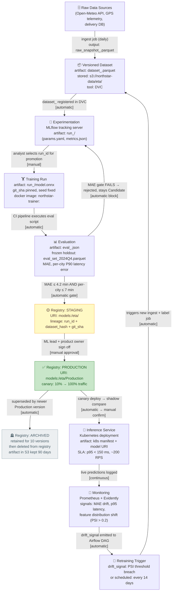

# ETA Model — MLOps Lifecycle

## Annotation key

| Symbol | Meaning |
|--------|---------|
| `[automatic]` | Triggered by CI/CD or Airflow DAG — no human action |
| `[manual]` | Requires named approver to click approve in MLflow UI |
| `[automatic gate]` | Metric threshold checked by eval script; blocks promotion on failure |

## Artifacts at each stage

| Stage | Artifact | Location |
|-------|----------|----------|
| Raw data | `raw_snapshot_<date>.parquet` | `s3://northstar-data/raw/` |
| Versioned dataset | `dataset_<sha256>.parquet` | DVC remote (`s3://northstar-data/dvc/`) |
| Training run | `run_<run_id>/model.onnx` + `params.yaml` + `metrics.json` | MLflow artifact store |
| Evaluation | `eval_<run_id>.json` | MLflow run artifact |
| Staging model | `models:/eta/<version>` | MLflow Model Registry |
| Production model | `models:/eta/Production` | MLflow Model Registry |
| Deployed config | `k8s/eta-deployment-<version>.yaml` | Git repo |
| Monitoring signal | `drift_report_<date>.json` | Prometheus + Evidently export |
